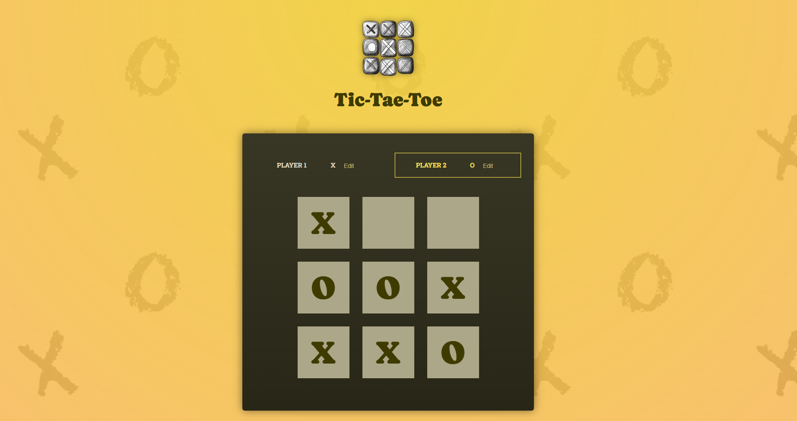

# Tic-Tac-Toe Game

A simple and interactive Tic-Tac-Toe game built using React.

## Features
- Two-player gameplay (Player 1: X, Player 2: O)
- Dynamic turn-based play
- Winner detection based on standard Tic-Tac-Toe rules
- Draw detection
- Ability to restart the game
- Players can change their names

## Installation

1. Clone the repository:
   ```sh
   git clone <repository-url>
   ```

2. Navigate to the project folder:
   ```sh
   cd tic-tac-toe
   ```

3. Install dependencies:
   ```sh
   npm install
   ```

## Usage

To start the application, run:
```sh
npm run dev
```
This will launch the game in your browser at `http://localhost:3000/`.

## Components

### `App.js`
- Manages game state and player turns.
- Determines the winner or if there's a draw.

### `GameBoard.jsx`
- Displays the 3x3 game board.
- Allows players to make moves.

### `Player.jsx`
- Displays player names and allows editing.

### `Log.jsx`
- Displays the history of moves made.

### `GameOver.jsx`
- Shows the winner or a draw message and allows restarting the game.

## How to Play
1. Players take turns selecting a square on the 3x3 board.
2. The first player to align three marks in a row, column, or diagonal wins.
3. If all squares are filled and no one has won, the game ends in a draw.
4. Click "Rematch!" to restart the game.

## License
This project is licensed under the MIT License.

## Screenshot



